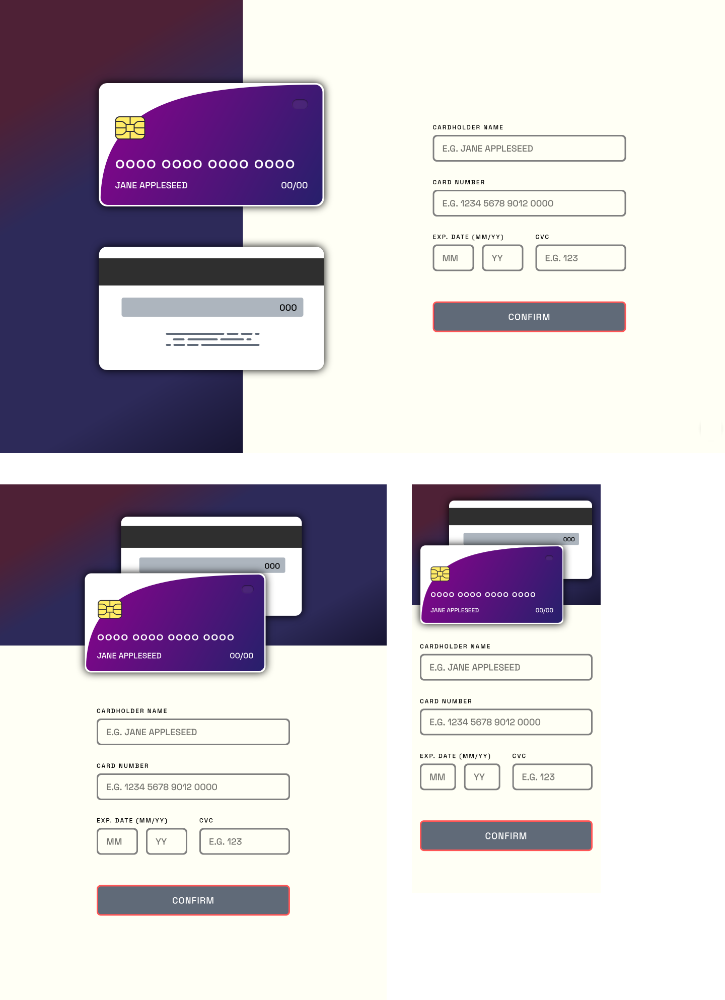
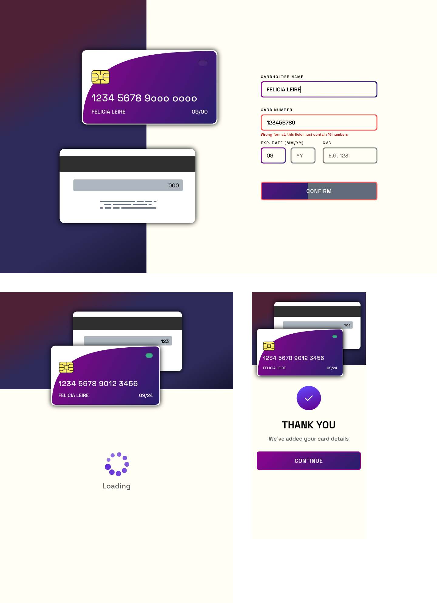
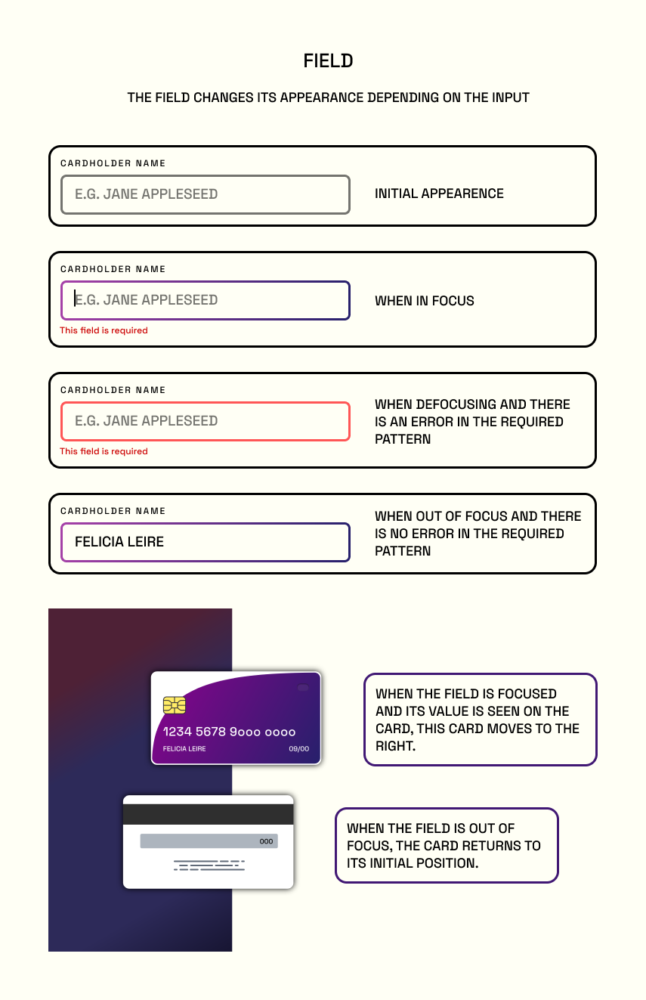
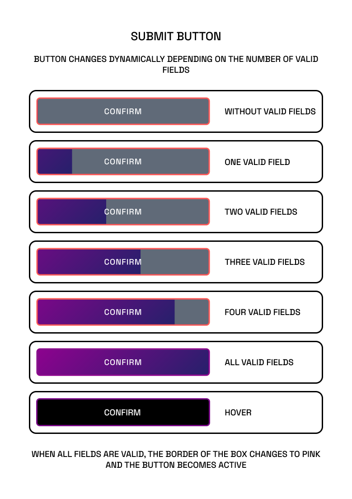

# Frontend Mentor - Interactive card details form solution

This is a solution to the [Interactive card details form challenge on Frontend Mentor](https://www.frontendmentor.io/challenges/interactive-card-details-form-XpS8cKZDWw). Frontend Mentor challenges help you improve your coding skills by building realistic projects. 

## Table of contents

- [Overview](#overview)
  - [The challenge](#the-challenge)
  - [Screenshot](#screenshot)
  - [Links](#links)
- [My process](#my-process)
  - [Built with](#built-with)
  - [What I learned](#what-i-learned)
  - [Continued development](#continued-development)
  - [Useful resources](#useful-resources)
- [Author](#author)

## Overview

### The challenge

Users should be able to:

- Fill in the form and see the card details update in real-time
- Receive error messages when the form is submitted if:
  - Any input field is empty
  - The card number, expiry date, or CVC fields are in the wrong format
- View the optimal layout depending on their device's screen size
- See hover, active, and focus states for interactive elements on the page
- **Bonus** 
    - Animation on dynamic fill button
    - New bank card design 
    - Move effect when focus on card inputs
    - Loader component

### Screenshot

#### Solution of the challenge view on mobile, tablet and desktop devices

#### All solution components in different device sizes

#### field states

#### Button states

### Links

- [Solution URL](https://github.com/Alejandro25AR/interactive-card-details-form)
- [Live Site URL](https://alejandro25ar.github.io/interactive-card-details-form/)

## My process

### Built with

- Semantic HTML5 markup
- [React](https://reactjs.org/) - JS library
- [Sass](https://sass-lang.com/) - CSS preprocessor
- Flexbox
- Mobile-first workflow

### What I learned

- I practice to develop a small application with the React library.
  - Use Hooks
    - useState to control the state of variables in the application
    - useEffect for component lifecycle management
    - useRef to get the reference of elements in the virtual DOM
  - Communication between components
  - Event handling
  - Syntax of JSX
- I learn how to separate the logic from the view in a component.
### Continued development

- Continue developing project with JS react library.
- Learn and apply best practices in react.
- Implement an architecture that helps you better understand the applications you develop.

### Useful resources

- Youtube Channel [Jon Mircha](https://www.youtube.com/c/jonmircha) -This is an excellent channel for learning web development.

## Author

- Frontend Mentor - [@Alejandro25AR](https://www.frontendmentor.io/profile/Alejandro25AR)